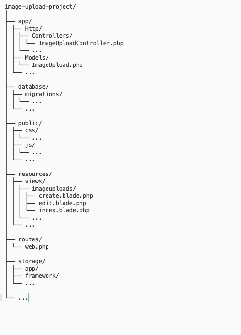
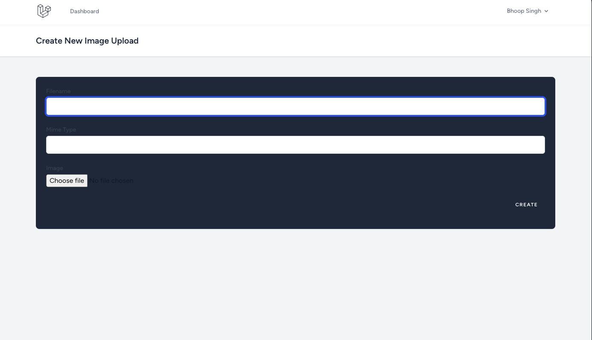
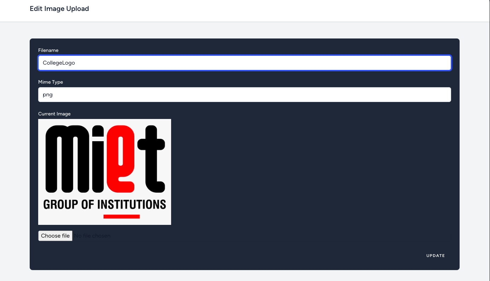
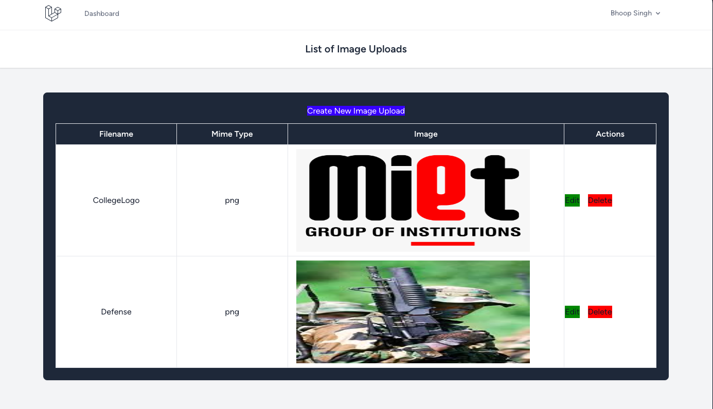

# Image Upload Project

## Description
This project is a simple image upload application built using Laravel. Users can upload images, edit image details, and delete images. The application also includes user authentication to manage access control.

## Installation
1. Clone the repository: `git clone <repository_url>`
2. Navigate to the project directory: `cd <project_directory>`
3. Install dependencies: `composer install && npm install`
4. Set up your environment file: `cp .env.example .env`
5. Generate application key: `php artisan key:generate`
6. Set up your database configurations in the `.env` file
7. Run migrations: `php artisan migrate`
8. Serve the application: `php artisan serve`

## Directory Structure

## Functionality
- **Image Upload**: Users can upload images along with filename and MIME type.
- **Image Editing**: Users can edit image details such as filename and MIME type.
- **Image Deletion**: Users can delete uploaded images.
- **Listing Images**: Display a list of uploaded images with their details.
- **Authentication**: Utilize Laravel's authentication system to manage user sessions and access control.

## Features
- **Upload Validation**: Validate image uploads based on file type and size.
- **Image Rendering**: Render images on the frontend using base64 encoding.
- **CRUD Operations**: Perform CRUD operations on image uploads.
- **User Authentication**: Ensure only authenticated users can perform image operations.

## Technologies Used
- Laravel
- MySQL
- HTML/CSS
- JavaScript

## Functional Images

